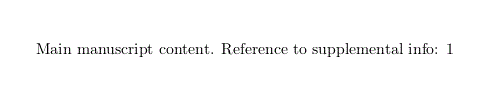

# LaTeX Cross-File Referencing

This repository demonstrates how to implement cross-file referencing in LaTeX documents, specifically between a main manuscript and supplemental information. 



For more details, please visit [Kathleen Hupfeld's guide](https://kathleenhupfeld.com/referring-to-figure-and-table-names-across-two-documents-in-latex/).


## File Structure

```
.
├── Manuscript_Text.tex
├── Supplemental_Info.tex
├── latexmkrc
└── README.md
```

## Usage

1. Edit `Manuscript_Text.tex` and `Supplemental_Info.tex` as needed.
2. Compile both files using the following commands:

```bash
compile(){
    input_filename=$1
    output_filename=${2:-$1}
    pdflatex -interaction=nonstopmode -jobname="$output_filename" "$input_filename.tex"
    bibtex "$output_filename"
    pdflatex -interaction=nonstopmode -jobname="$output_filename" "$input_filename.tex"
    pdflatex -interaction=nonstopmode -jobname="$output_filename" "$input_filename.tex"
}

compile Supplemental_Info # Before compiling Manuscript_Text
compile Manuscript_Text
```

## Results
[`Manuscript_Text.pdf`](./Manuscript_Text.pdf), including the reference to a table in Supplemental_Info.tex 

## Key Components

- `latexmkrc`: Configuration file for `latexmk` to handle cross-file dependencies.
- `\myexternaldocument` command: Defined in both TeX files to establish cross-referencing.

## Generated Files

```
.
├── latexmkrc
├── Manuscript_Text.aux
├── Manuscript_Text.bbl
├── Manuscript_Text.blg
├── Manuscript_Text.log
├── Manuscript_Text.pdf
├── Manuscript_Text.tex
├── Manuscript_Text.tex.log
├── README.md
├── Supplemental_Info.aux
├── Supplemental_Info.bbl
├── Supplemental_Info.blg
├── Supplemental_Info.log
├── Supplemental_Info.pdf
└── Supplemental_Info.tex
```
